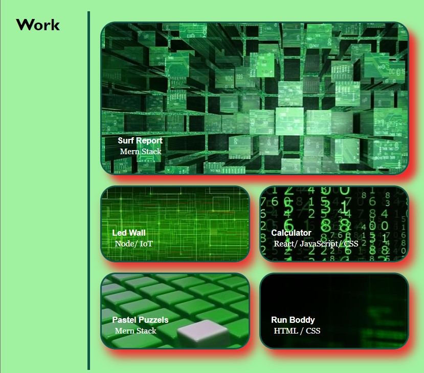

# 02 Advanced CSS: My Portfolio

## Description

This portifolio has been developed from scratch as a homework challenge that will be receiving improveents thoughtout the course. It has really challenged me to be aware of small details that might be very attractive to the end-user.

Also, I could better understand the connection between CSS and HTML, and realize some tricks to solve the problems.

The requirements, such as, navigation and responsive design are crucial and the most interactive part that can never been overlooked to have a great deployment.

Therefore, thinking as an end-user is also one of the keys to success, because when browsing through the work you have developed, you start realizing where the improvements may happen.

## Usage
The webpage has been developed using VS Code, where the structure was created in HTML and CSS. 

The webpage is a presentention of a professional personal portifolio of a Web Developer, which aims to provide to the end-user with information about the skills of the developer and multiple ways to contact and request his services.

The animation below shows how all the content will look when accessed from a mobile/small screen, when the page components change size and position for better interactivity.

The instructions below show how the webpage interacts on larger screens.

In the following image, there is a “header” that presents the name of the developer and navigation options through the site, where with a click it will go to the corresponding subject.
Just below the header is shown a subtitle with the developer's profile picture and a description of what the page means.

Already moving to the body of the page, the first topic found is a personal description of the developer, where his history is briefly outlined.

The next section is considered the most important part of the site as this is where the developer portfolio is attached.

When going through the topics, they have a little interaction with the end-user to become more attractive and when clicking on them, you are redirected to the respective project.

PS: All interactions move to the same project since I only have one so far.

At the bottom are the ways in which the developer can be reached and also links to research a little more about him on Social Media.

## Development & Deployment

The web page content has a Responsive Web Design, designed by CSS that manages the HTML content to be resized, shrink, hide or move to fit your needs and look good on any screen.

The screenshot below shows part of the CSS code, where the :hover and @media functions are responsible for providing more interaction and adjusting the screen according to the end user's needs.

As shown, '@media screen (min-width)' was used in this project to develop it for small screens and then scale it for larger screens.

Regarding the HTML code, it is vital that you declare the meta elements correctly to link HTML and CSS and also ensure that the page has the required responsive design. The following image shows the essential meta viewport element for responsive design followed by links to connect HTML and CSS, which will apply the CSS codes in HTML and reset the browser.

### Deployed Website

https://robinsonfdossantos.github.io/Advanced-CSS/

For more information, use the browser's DevTools by typing Ctrl + Shift + I.

## Credits

Members of the Bootcamp team, who introduced and taught me how to use all the tools used to develop this page.

## License

Licensed under the MIT license.